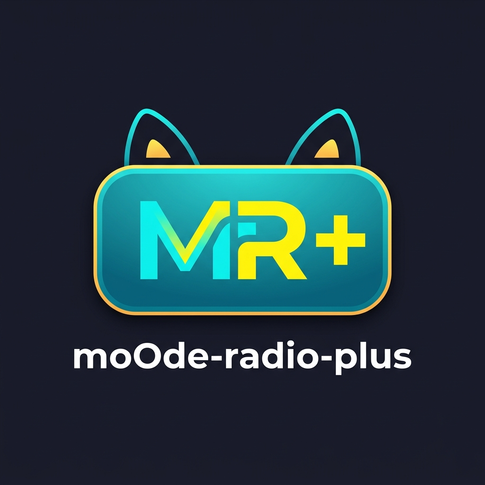
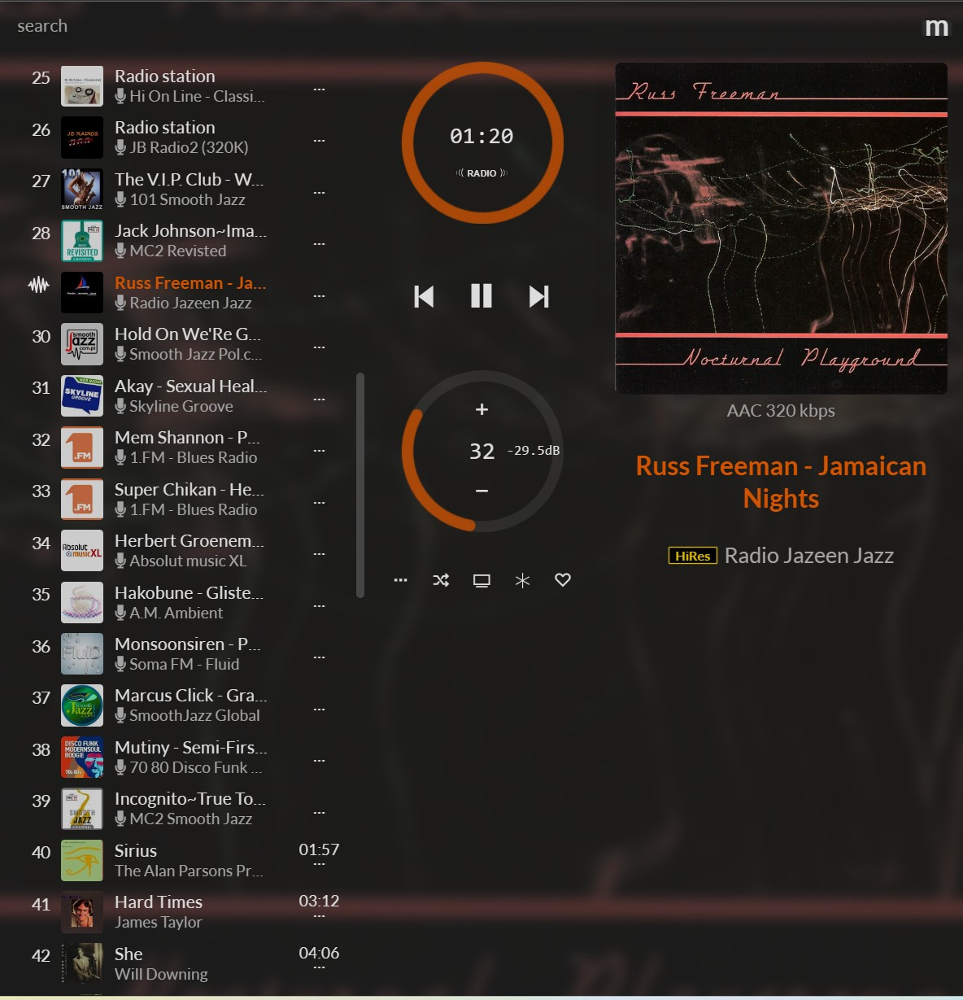
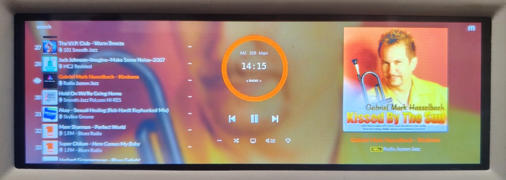
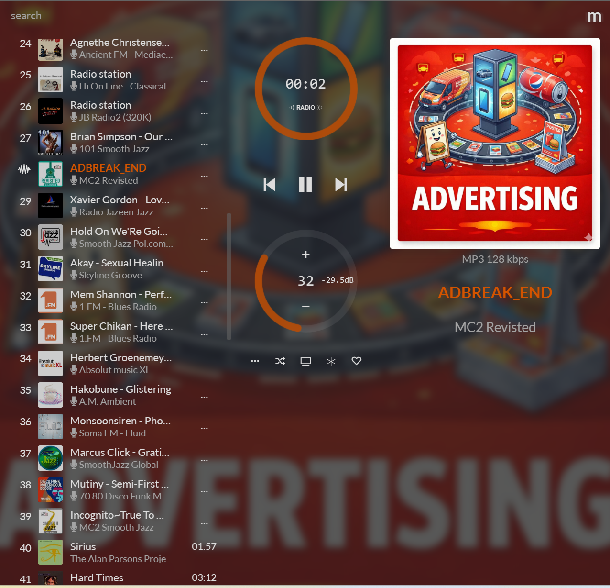
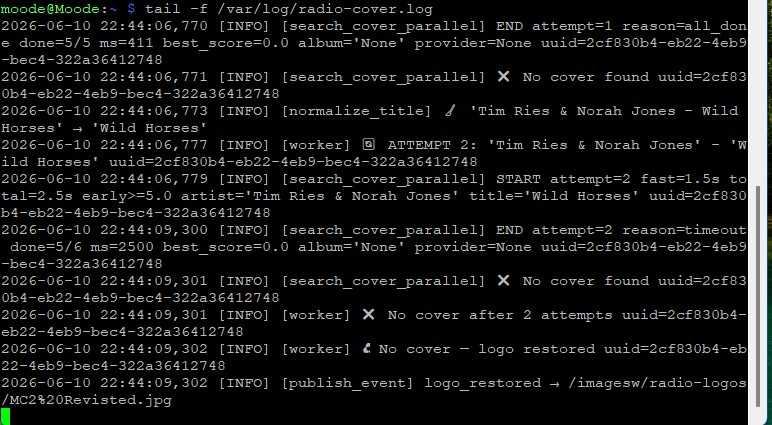
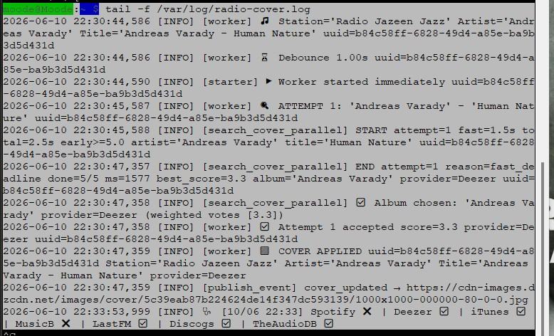
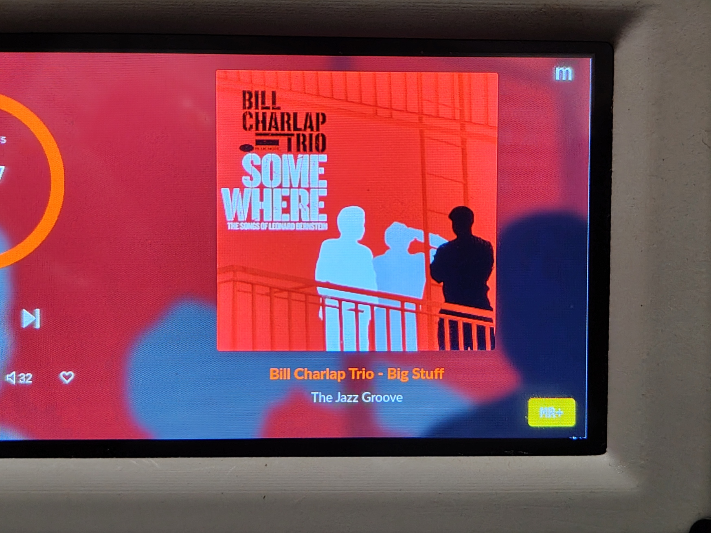
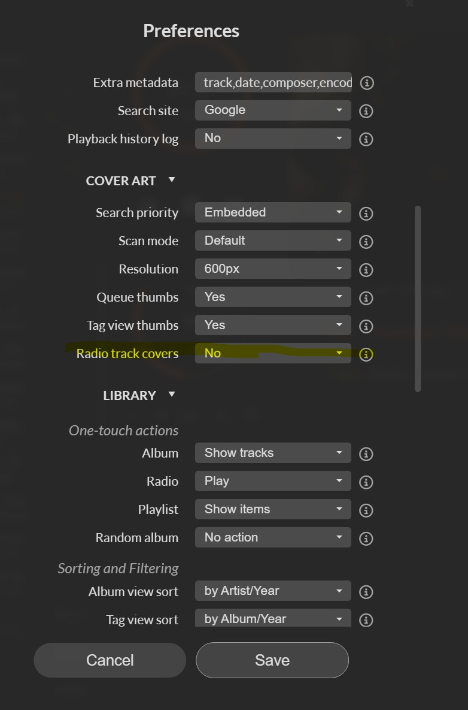
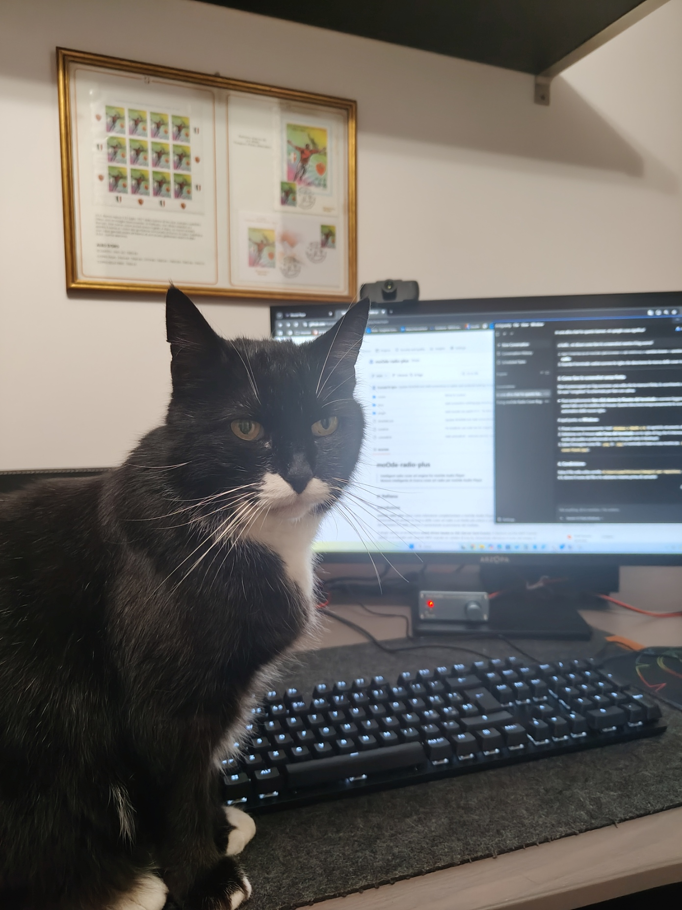

<div align="center">
  
</div>

# moOde-radio-plus

<p align="center">
  
  
  
</p>

## 🇮🇹 Italiano

### Introduzione

**moOde-radio-plus** nasce come estensione complementare per moOde Audio Player, con l'obiettivo di portare la ricerca delle copertine radio (Radio Cover Art) a un livello superiore. L'obiettivo primario è **ridurre drasticamente il "rumore"** generato dai metadata ICY spesso "sporchi" o promozionali trasmessi dalle stazioni radio, aumentando al contempo l'accuratezza e la velocità dei risultati.

Il plugin adotta un'**architettura event-driven basata su SSE (Server-Sent Events)**: il daemon si interfaccia con MPD (Music Player Daemon) mettendosi in ascolto tramite il comando `idle()`. Questo significa che il sistema si "sveglia" *solo* ed esclusivamente nel momento in cui MPD segnala un effettivo cambio di traccia, rimanendo silente e a consumo zero per il resto del tempo. La nuova copertina trovata viene inviata in tempo reale al frontend tramite una connessione push, eliminando la necessità di continui polling dal browser e riducendo a zero la latenza percepita.

✅ **Testato e verificato su moOde Audio Player v10.2.4 (Raspberry Pi 4 / Driver VC4)**

| Web UI (Browser) | Local Display (Kiosk) |
| :---: | :---: |
|  |  |

### Come funziona

#### 1. Noise Gate a Tre Livelli

Il cuore del plugin è un filtro (*noise gate*) che scarta i falsi positivi prima ancora di effettuare la ricerca:
- **Scansione segmenti**: Riconosce jingle, giornali radio, meteo, traffico e pubblicità (es. `ADBREAK`, `News`).
- **Scansione pattern**: Filtra schemi classici dei metadata sporchi (es. `Artista - 2024`).
- **Soglia di similarità (Vacuum gate)**: Se il titolo trasmesso è troppo simile al nome stesso della stazione radio, viene scartato per evitare cover casuali.

#### 2. Normalizzazione Aggressiva del Testo

Se il brano supera il noise gate, passa attraverso due tentativi di pulizia del testo:
- **Tentativo 1 (Light)**: Rimuove i `feat.`, `with`, `voc.` e caratteri spuri. Se non trova nulla...
- **Tentativo 2 (Aggressive)**: Rimuove stringhe url (es. `.com`, `www.`), tag come `(Original Mix)`, `(Remix)` e applica euristiche avanzate per estrarre solo il nome puro dell'artista e del brano.

#### 3. Ricerca Parallela Multithread

La ricerca non viene effettuata su un singolo database, ma contemporaneamente su 7 provider differenti tramite un `ThreadPoolExecutor`:
- Spotify
- Deezer
- iTunes
- MusicBrainz
- LastFM
- Discogs
- TheAudioDB

#### 4. Algoritmo di Punteggio Deterministico

Il primo risultato che arriva non è necessariamente quello che viene scelto. Tutti i risultati trovati nel tempo prestabilito vengono inseriti in un algoritmo di *weighted scoring* (punteggio pesato).

Il punteggio si basa su:
- **Tipologia di release**: Un "Album" originale (peso 1.0) vince sempre su un "Singolo" (0.9), che a sua volta vince su una "Compilation" (0.4) o su un "Appears On" (0.5).
- **Match titolo-album**: Se il titolo del brano coincide esattamente con il nome dell'album, riceve un moltiplicatore x1.5.
- **Penalità Best Of**: Gli album "Greatest Hits" o "Vol. 1" vengono fortemente penalizzati (peso 0.4) per favorire le copertine degli album originali del brano.

#### 5. Dual Deadline + Early Stop

- **Fast deadline (1.5s)** — se almeno un provider ha risposto entro 1.5s, il sistema usa il miglior risultato disponibile senza aspettare gli altri
- **Total deadline (2.5s)** — limite massimo assoluto
- **Early stop** — se il punteggio aggregato supera 5.0, la ricerca si ferma immediatamente senza aspettare i provider lenti

#### 6. Selezione della Miglior Risoluzione

Tra le cover dello stesso album trovate da provider diversi, viene scelta quella con la risoluzione più alta tramite 3 pass progressivi: analisi URL → HTTP HEAD → streaming PIL.

#### 7. Cover di Segmento

Durante lo streaming radiofonico, le emittenti trasmettono spesso metadati di servizio (es. `ADBREAK_END` o `Commercial` per la pubblicità). Il sistema nativo di moOde tenta di cercare questi testi come se fossero brani musicali, finendo per visualizzare copertine casuali, decontestualizzate o completamente errate (come nell'esempio del falso positivo a sinistra).

Quando il *noise gate* di MR+ identifica un segmento noto, blocca questa ricerca errata e mostra invece una cover dedicata e coerente (a destra):

| moOde Nativo (Falso Positivo) | MR+ (Cover di Segmento) |
| :---: | :---: |
|  |  |

| Segmento | Keywords riconosciute |
|---|---|
| 🌤 Meteo | meteo, weather, wetter, météo, previsioni |
| 🚗 Traffico | traffico, traffic, verkehr, trafic, viabilità |
| 📰 News | news, notizie, nachrichten, sport, info, promo |
| 📢 Pubblicità | adbreak, ad break, advert, advertising, spot, AD, ADBREAK_END |

#### 8. Ripristino logo di stazione (Fallback)

Se la ricerca parallela fallisce su tutti i provider (nessun risultato valido trovato dopo i 2 tentativi di pulizia metadata), il daemon ripristina automaticamente il logo originale della stazione radio. Questo garantisce che la schermata non rimanga vuota o con una cover generica non pertinente.

<p align="center">
  
</p>

#### 9. Health check automatico

Ogni 5 minuti il daemon verifica autonomamente che tutti i provider siano raggiungibili, usando una traccia di riferimento fissa (The Beatles – Yesterday). Il risultato viene registrato nel log.

<p align="center">
  
</p>

#### 10. Snippet JS V7.11 — Difesa attiva lato frontend

Lo snippet JS `moode_radio_plus_snippet.js` viene copiato in `/var/www/js/` e caricato tramite un tag `<script>` iniettato in `header.php`. Questo approccio è **chirurgico e non invasivo**: non tocca nessun file minificato di sistema come `lib.min.js`, sopravvive agli aggiornamenti di moOde e si rimuove con un singolo comando.

A runtime, lo snippet protegge la cover SSE da tre direzioni simultanee:

- **Layer 1** — intercetta `$.fn.html` di jQuery e blocca qualsiasi scrittura sui div cover quando SSE è attivo
- **Layer 2** — MutationObserver su `img.src`: ripristina immediatamente l'URL SSE se moOde tenta di sovrascriverlo con il logo della stazione
- **Layer 3** — property hijack su `MPD.json.coverurl`: forza il valore SSE ad ogni ciclo di polling moOde

Questo approccio a tre livelli garantisce che la cover ad alta risoluzione rimanga sempre visibile indipendentemente da qualsiasi interazione dell'utente o re-render nativo di moOde. A differenza delle versioni precedenti che usavano CSS override (`content: url()`), lo snippet V7.11 opera esclusivamente tramite `img.src` diretto, garantendo **piena compatibilità con il driver grafico VC4 del Raspberry Pi 4** senza causare kernel panic.

> **Stabilità verificata** — La V7.11 è stata sottoposta a stress test intensivi: ore di zapping continuo, interazione sulla copertina, cambio sorgente NAS/Radio, tutto senza mai causare artefatti grafici, lag audio o crash del Kiosk.

#### 11. Badge MR+ — indicatore visivo con toggle on/off

Il plugin mostra un badge **MR+** nell'angolo in basso a destra dell'interfaccia. Il badge è interattivo e permette di attivare/disattivare il plugin al volo, sia da touch (kiosk) che da click (browser).

| Stato | Badge | Colore |
|---|---|---|
| Plugin attivo | **MR+** | 🟡 Giallo |
| Plugin disattivato | **MR-** | 🔵 Celeste |
| SSE disconnesso | **MR+** | 🔵 Celeste (bassa opacità) |

Kiosk e browser operano in modo **indipendente**: ogni client può attivare o disattivare il plugin senza influenzare gli altri. Quando il plugin viene disattivato, il logo originale della stazione viene ripristinato automaticamente.

I colori sono stati scelti per essere accessibili anche a utenti daltonici (no combinazioni rosso/verde).

| Browser con MR+ attivo | Kiosk con MR+ attivo |
| :---: | :---: |
|  |  |

### Prerequisito

In moOde: **Preferences → Cover Art → Radio track covers = No**

<p align="center">
  
</p>

### Installazione

```bash
bash <(curl -fsSL https://raw.githubusercontent.com/frantale70-lgtm/moOde-radio-plus/main/install.sh)
```

> 💡 **Smart Install**: lo script rileva e si adatta automaticamente all'utente di sistema (es. `pi` o `moode`), garantendo un'installazione perfetta indipendentemente dalla configurazione del vostro Raspberry Pi.

> 🔑 **Config preservato**: in caso di reinstallazione, il file di configurazione con le API keys non viene sovrascritto — le chiavi vengono mantenute automaticamente.

Al termine inserire le API keys nel file di configurazione:

```
/opt/moOde_Radio_Cover/moode_sse_server.config
```

Riavviare il daemon:

```bash
sudo systemctl restart moode-sse
```

Svuotare la cache del kiosk:

```bash
rm -rf /home/$USER/.cache/chromium
sudo systemctl restart localdisplay.service
```

### Disinstallazione

Per rimuovere completamente il plugin e ripristinare lo stato iniziale del sistema:

```bash
bash <(curl -fsSL https://raw.githubusercontent.com/frantale70-lgtm/moOde-radio-plus/main/uninstall.sh)
```

### API Keys

| Provider | Key | Dove ottenerla |
|---|---|---|
| iTunes | — | Non richiede API key |
| Deezer | — | Non richiede API key o abbonamento |
| LastFM | `LASTFM_API_KEY` | [last.fm/api](https://www.last.fm/api) |
| MusicBrainz | — | Non richiede API key |
| Discogs | `DISCOGS_TOKEN` | [discogs.com/settings/developers](https://www.discogs.com/settings/developers) |
| TheAudioDB | `THEAUDIODB_API_KEY` | [theaudiodb.com/api_guide.php](https://www.theaudiodb.com/api_guide.php) |
| Spotify | `SPOTIFY_CLIENT_ID` / `SPOTIFY_CLIENT_SECRET` | [developer.spotify.com](https://developer.spotify.com) — richiede account Premium |

### Permessi file

Il plugin viene installato con permessi standard. Per modificare i file dopo l'installazione:

**Config** (l'unico file che l'utente deve modificare — API keys e parametri):
```bash
sudo chmod 664 /opt/moOde_Radio_Cover/moode_sse_server.config
```

**Daemon e snippet** (per sviluppatori e contributor):
```bash
sudo chown $USER:$USER /opt/moOde_Radio_Cover/moode_sse_server.py
sudo chmod 775 /opt/moOde_Radio_Cover/moode_sse_server.py
sudo chmod 644 /var/www/js/moode_radio_plus_snippet.js
sudo chown root:root /var/www/js/moode_radio_plus_snippet.js
```

### Autori e Ringraziamenti

- **Ivo Scagliola** — co-autore, progettazione, sviluppo e testing finale
- **Marco Mosca** — co-autore, progettazione, sviluppo e testing

Un ringraziamento speciale alla gatta **Calzina**, per la costante compagnia (e i test di pazienza sulla tastiera) durante le sessioni di sviluppo di questo progetto.

<p align="center">
  
</p>

### Licenza

MIT License

## SOS Install Panic
In caso di problemi con una nuova versione dell'installazione o un aggiornamento che rompe il sistema, è disponibile uno script di emergenza chiamato `reverse_install.sh`.
Questo script (versione V7.11 sicura) esegue una disinstallazione completa della versione corrente e ripristina automaticamente l'ultimo ecosistema stabile testato (server, script e configurazioni) presente nella cartella `obsolete/v7.11_lib_min_injection/`.

Per usarlo, esegui semplicemente:
```bash
bash reverse_install.sh
```

## Dietro le quinte: Architettura Isolamento V7.11

1. **L'ambiente isolato (`obsolete/`)**: La capsula di salvataggio `v7.11_lib_min_injection` incapsula la versione più robusta testata per moOde.
2. **Isolamento Stagno**: I file vitali (server, config, service e snippet JS) sono sigillati in questa cartella. L'`install.sh` di backup è stato hardcoded per pescare i file esclusivamente da questo ambiente locale isolato. 
3. **Rollback Script**: Il file `reverse_install.sh` disinstalla la versione corrente e re-innesca in automatico l'installazione blindata della V7.11.

> In questo modo, qualsiasi esperimento o iniezione sperimentale futura (es. su `header.php`) che dovesse rompere il display, può essere neutralizzata e riportata a una baseline sicura in pochissimi secondi.

---

## 🇬🇧 English

### Introduction

**moOde-radio-plus** is designed as a complementary extension to moOde Audio Player, with the aim of adding functionality that brings radio cover art search to a more extensive and articulated level, reducing the noise generated by station ICY metadata and increasing the accuracy of results.

The plugin adopts an **event-driven architecture based on SSE (Server-Sent Events)**: the daemon listens to MPD via `idle()` and wakes up *only* when MPD signals a track change, remaining silent the rest of the time. The frontend receives the new cover in real time via push, without continuous polling and without artificial latency.

✅ **Tested and verified on moOde Audio Player v10.2.4**

| Web UI (Browser) | Local Display (Kiosk) |
| :---: | :---: |
|  |  |

### How it works

#### 1. Three-level Noise Gate

The core of the plugin is a filter (*noise gate*) that discards false positives before even performing a search:
- **Segment scanning**: Recognises jingles, news, weather, traffic and advertising (e.g. `ADBREAK`, `News`).
- **Pattern scanning**: Filters classic patterns of dirty metadata (e.g. `Artist - 2024`).
- **Similarity threshold (Vacuum gate)**: If the transmitted title is too similar to the radio station name itself, it is discarded to avoid random covers.

#### 2. Aggressive Text Normalisation

If the track passes the noise gate, it goes through two text cleaning attempts:
- **Attempt 1 (Light)**: Removes `feat.`, `with`, `voc.` and spurious characters. If it finds nothing...
- **Attempt 2 (Aggressive)**: Removes url strings (e.g. `.com`, `www.`), tags like `(Original Mix)`, `(Remix)` and applies advanced heuristics to extract only the pure name of the artist and the track.

#### 3. Multithreaded Parallel Search

The search is not performed on a single database, but simultaneously on 7 different providers via a `ThreadPoolExecutor`:
- Spotify
- Deezer
- iTunes
- MusicBrainz
- LastFM
- Discogs
- TheAudioDB

#### 4. Deterministic Scoring Algorithm

The first result that arrives is not necessarily the one chosen. All results found within the set time are fed into a *weighted scoring* algorithm.

The score is based on:
- **Release type**: An original "Album" (weight 1.0) always beats a "Single" (0.9), which in turn beats a "Compilation" (0.4) or an "Appears On" (0.5).
- **Title-album match**: If the track title exactly matches the album name, it receives a x1.5 multiplier.
- **Best Of penalty**: "Greatest Hits" or "Vol. 1" albums are heavily penalised (weight 0.4) to favour covers of the track's original albums.

#### 5. Dual Deadline + Early Stop

- **Fast deadline (1.5s)** - if at least one provider has responded within 1.5s, the system uses the best available result without waiting for the others
- **Total deadline (2.5s)** - absolute maximum limit
- **Early stop** - if the aggregated score exceeds 5.0, the search stops immediately without waiting for slow providers

#### 6. Best Resolution Selection

Among covers of the same album found by different providers, the highest resolution one is chosen via 3 progressive passes: URL analysis → HTTP HEAD → PIL streaming.

#### 7. Segment Covers

During radio streaming, broadcasters often transmit service metadata (e.g., `ADBREAK_END` or `Commercial` for ads). The native moOde system attempts to search for these texts as if they were musical tracks, ending up displaying random, out-of-context, or completely incorrect covers (like the false positive example on the left).

When the MR+ *noise gate* identifies a known segment, it blocks this erroneous search and instead displays a dedicated, coherent cover (on the right):

| Native moOde (False Positive) | MR+ (Segment Cover) |
| :---: | :---: |
|  |  |

| Segment | Recognised keywords |
|---|---|
| 🌤 Weather | meteo, weather, wetter, météo, previsioni |
| 🚗 Traffic | traffico, traffic, verkehr, trafic, viabilità |
| 📰 News | news, notizie, nachrichten, sport, info, promo |
| 📢 Advertising | adbreak, ad break, advert, advertising, spot, AD, ADBREAK_END |

#### 8. Station Logo Restoration (Fallback)

If the parallel search fails on all providers (no valid result found after the 2 metadata cleaning attempts), the daemon automatically restores the original radio station logo. This ensures that the display doesn't remain blank or show an irrelevant generic cover.

<p align="center">
  
</p>

#### 9. Automatic Health Check

Every 5 minutes the daemon autonomously verifies that all providers are reachable, using a fixed reference track (The Beatles – Yesterday). The result is recorded in the log.

<p align="center">
  
</p>

#### 10. JS Snippet V7.11 — Active Frontend Defence

The JS snippet `moode_radio_plus_snippet.js` is copied to `/var/www/js/` and loaded via a `<script>` tag injected into `header.php`. This approach is **surgical and non-invasive**: it does not touch any minified system file like `lib.min.js`, survives moOde updates, and is removed with a single command.

At runtime, the snippet protects the SSE cover from three simultaneous directions:

- **Layer 1** — intercepts jQuery's `$.fn.html` and blocks any write to cover divs when SSE is active
- **Layer 2** — MutationObserver on `img.src`: immediately restores the SSE URL if moOde attempts to overwrite it with the station logo
- **Layer 3** — property hijack on `MPD.json.coverurl`: forces the SSE value on every moOde polling cycle

This three-layer approach ensures that the high-resolution cover remains always visible regardless of any user interaction or native moOde re-render. Unlike previous versions that used CSS overrides (`content: url()`), the V7.11 snippet operates exclusively via direct `img.src`, ensuring **full compatibility with the Raspberry Pi 4 VC4 graphics driver** without causing kernel panics.

> **Verified stability** — V7.11 has undergone intensive stress testing: hours of continuous zapping, cover interaction, NAS/Radio source switching — all without ever causing graphical artefacts, audio lag, or Kiosk crashes.

#### 11. MR+ Badge — Visual Indicator with On/Off Toggle

The plugin displays an **MR+** badge in the bottom-right corner of the interface. The badge is interactive and allows enabling/disabling the plugin on the fly, both via touch (kiosk) and click (browser).

| State | Badge | Colour |
|---|---|---|
| Plugin active | **MR+** | 🟡 Yellow |
| Plugin disabled | **MR-** | 🔵 Light blue |
| SSE disconnected | **MR+** | 🔵 Light blue (low opacity) |

Kiosk and browser operate **independently**: each client can enable or disable the plugin without affecting the others. When the plugin is disabled, the original station logo is automatically restored.

Colours were chosen to be accessible to colour-blind users (no red/green combinations).

| Browser with MR+ active | Kiosk with MR+ active |
| :---: | :---: |
|  |  |

### Prerequisite

In moOde: **Preferences → Cover Art → Radio track covers = No**

<p align="center">
  
</p>

### Installation

```bash
bash <(curl -fsSL https://raw.githubusercontent.com/frantale70-lgtm/moOde-radio-plus/main/install.sh)
```

> 💡 **Smart Install**: the script automatically detects and adapts to the current system user (e.g. `pi` or `moode`), ensuring a flawless installation regardless of your Raspberry Pi configuration.

> 🔑 **Config preserved**: on reinstall, the configuration file with API keys is not overwritten — your keys are kept automatically.

After installation, insert your API keys in the configuration file:

```
/opt/moOde_Radio_Cover/moode_sse_server.config
```

Restart the daemon:

```bash
sudo systemctl restart moode-sse
```

Clear the kiosk cache:

```bash
rm -rf /home/$USER/.cache/chromium
sudo systemctl restart localdisplay.service
```

### Uninstall

To completely remove the plugin and restore the system to its initial state:

```bash
bash <(curl -fsSL https://raw.githubusercontent.com/frantale70-lgtm/moOde-radio-plus/main/uninstall.sh)
```

### API Keys

| Provider | Key | Where to get it |
|---|---|---|
| iTunes | — | No API key required |
| Deezer | — | No API key or subscription required |
| LastFM | `LASTFM_API_KEY` | [last.fm/api](https://www.last.fm/api) |
| MusicBrainz | — | No API key required |
| Discogs | `DISCOGS_TOKEN` | [discogs.com/settings/developers](https://www.discogs.com/settings/developers) |
| TheAudioDB | `THEAUDIODB_API_KEY` | [theaudiodb.com/api_guide.php](https://www.theaudiodb.com/api_guide.php) |
| Spotify | `SPOTIFY_CLIENT_ID` / `SPOTIFY_CLIENT_SECRET` | [developer.spotify.com](https://developer.spotify.com) — requires Premium account |

### File Permissions

The plugin is installed with standard permissions. To modify files after installation:

**Config** (the only file users need to edit — API keys and parameters):
```bash
sudo chmod 664 /opt/moOde_Radio_Cover/moode_sse_server.config
```

**Daemon and snippet** (for developers and contributors):
```bash
sudo chown $USER:$USER /opt/moOde_Radio_Cover/moode_sse_server.py
sudo chmod 775 /opt/moOde_Radio_Cover/moode_sse_server.py
sudo chmod 644 /var/www/js/moode_radio_plus_snippet.js
sudo chown root:root /var/www/js/moode_radio_plus_snippet.js
```

### Authors and Acknowledgements

- **Ivo Scagliola** — co-author, design, development and final testing
- **Marco Mosca** — co-author, design, development and testing

Special thanks to **Calzina** the cat, for her constant company (and keyboard-walking tests) during the development of this project.

<p align="center">
  
</p>

### License

MIT License

## SOS Install Panic
In case of problems with a new installation version or an update that breaks the system, an emergency script called `reverse_install.sh` is available.
This script (safe V7.11 version) performs a complete uninstallation of the current version and automatically restores the last tested stable ecosystem (server, scripts, and configurations) located in the `obsolete/v7.11_lib_min_injection/` folder.

To use it, simply run:
```bash
bash reverse_install.sh
```

## Behind the scenes: V7.11 Isolation Architecture

1. **The isolated environment (`obsolete/`)**: The `v7.11_lib_min_injection` rescue capsule encapsulates the most robust version tested for moOde.
2. **Watertight Isolation**: The vital files (server, config, service, and JS snippet) are sealed within this folder. The backup `install.sh` has been hardcoded to fetch files exclusively from this isolated local environment.
3. **Rollback Script**: The `reverse_install.sh` file uninstalls the current version and automatically triggers the armored installation of V7.11.

> This way, any future experiment or experimental injection (e.g., on `header.php`) that might break the display can be neutralized and reverted to a safe baseline in just a few seconds.