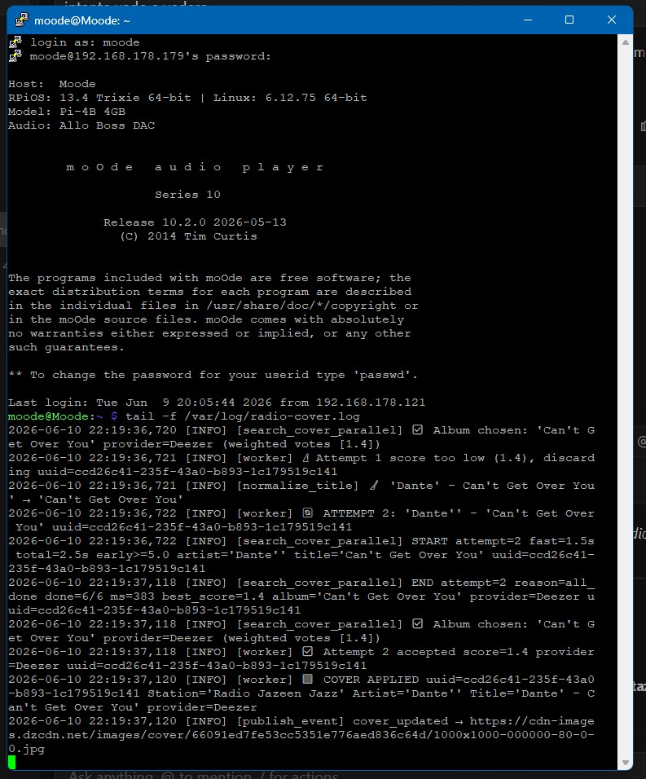

# moOde-radio-plus

> **Intelligent radio cover art engine for moOde Audio Player**  
> **Motore intelligente di ricerca cover art radio per moOde Audio Player**

---

## 🇮🇹 Italiano

### Introduzione

**moOde-radio-plus** nasce come estensione complementare a moOde Audio Player, con l'intento di aggiungere funzionalità che portino la ricerca delle cover art radio a un livello più esteso e articolato, riducendo il rumore generato dai metadata ICY delle stazioni e aumentando la precisione del risultato.

Il plugin adotta un'architettura **event-driven basata su SSE (Server-Sent Events)**: il daemon ascolta MPD tramite `idle()` e si risveglia *solo* quando MPD segnala un cambio di traccia, rimanendo silenzioso il resto del tempo. Il frontend riceve la nuova cover in tempo reale via push, senza polling continuo e senza latenza artificiale.

| Web UI (Browser) | Local Display (Kiosk) |
| :---: | :---: |
|  |  |

### Come funziona

#### 1. Noise Gate a tre livelli

Prima ancora di avviare una ricerca, il daemon analizza il metadata ricevuto da MPD e decide se è un segnale valido o rumore da ignorare.

- **Vacuum gate** — titolo assente, troppo corto o uguale al nome stazione → scartato
- **Segment gate** — riconosce keyword multilingua per news, meteo, traffico e pubblicità → mostra la cover di segmento dedicata invece di cercare una cover inesistente
- **Similarity gate** — titolo troppo simile al nome stazione (fuzzy match ≥ 60%) → scartato
- **Pattern gate** — riconosce pattern di rumore specifici: `~~~`, `AD`, `ADBREAK_END`, `jingle`, `promo`, `stationid`, titoli con anno stile `NomeStazione - 2025`

#### 2. Pulizia metadata a due stadi

Il metadata ICY trasmesso dalle stazioni radio è spesso sporco: URL di stazione nel campo artista, featuring, caratteri speciali, prefissi. Il daemon lo pulisce prima di interrogare i provider.

- **Attempt 1** — pulizia leggera: rimuove `feat.`, `ft.`, `featuring`, `with` dal titolo. Ricerca rapida.
- **Attempt 2** — pulizia aggressiva: `clean_artist_name()` rimuove URL, suffissi `.com/.fm`, prefissi stazione, remix/compilation dal campo artista. `normalize_title()` rimuove parentesi, slash, caratteri speciali, prefissi `Artista - ` duplicati.

#### 3. Ricerca parallela su 7 provider

I provider vengono interrogati **simultaneamente** tramite `ThreadPoolExecutor`. Non in sequenza — in parallelo. Ogni provider risponde nei tempi che riesce, il sistema raccoglie i risultati e li valuta.

Provider supportati: **iTunes, Deezer, LastFM, MusicBrainz, Discogs, TheAudioDB, Spotify**

<p align="center">
  
</p>

#### 4. Scoring pesato per tipo di release

I risultati non vengono scelti per primo-arrivato. Ogni cover viene pesata in base al tipo di release dell'album trovato:

| Tipo | Peso |
|---|---|
| Album | 1.0 |
| Single | 0.9 |
| Live | 0.8 |
| EP | 0.7 |
| Compilation | 0.4 |
| Best of / Greatest Hits | 0.6 |

Bonus x1.5 se il titolo corrisponde esattamente al nome dell'album. Penalità se l'artista è già nel nome dell'album (segnale di compilation). Cover con "Vol." o "Volume" penalizzate.

I risultati di provider diversi vengono raggruppati per similarità del nome album (fuzzy ≥ 80%) — se iTunes e Deezer trovano lo stesso album, i loro voti si sommano.

#### 5. Dual deadline + Early stop

- **Fast deadline (1.5s)** — se almeno un provider ha risposto entro 1.5s, il sistema usa il miglior risultato disponibile senza aspettare gli altri
- **Total deadline (2.5s)** — limite massimo assoluto
- **Early stop** — se il punteggio aggregato supera 5.0, la ricerca si ferma immediatamente senza aspettare i provider lenti

#### 6. Selezione della risoluzione migliore

Tra le cover dello stesso album trovate da provider diversi, viene scelta quella con la risoluzione più alta tramite 3 pass progressivi: analisi URL → HTTP HEAD → streaming PIL.

#### 7. Cover di segmento

Quando il noise gate identifica un segmento noto, invece del logo stazione viene mostrata una cover dedicata:

| Segmento | Keywords riconosciute |
|---|---|
| 🌤 Meteo | meteo, weather, wetter, météo, previsioni |
| 🚗 Traffico | traffico, traffic, verkehr, trafic, viabilità |
| 📰 News | news, notizie, nachrichten, sport, info, promo |
| 📢 Pubblicità | adbreak, ad break, advert, advertising, spot, AD, ADBREAK_END |

<p align="center">
  
</p>

#### 8. Health check automatico

Ogni 5 minuti il daemon verifica autonomamente che tutti i provider siano raggiungibili, usando una traccia di riferimento fissa (The Beatles – Yesterday). Il risultato viene registrato nel log.

<p align="center">
  
</p>

#### 9. Snippet JS — difesa lato frontend

Lo snippet JS iniettato in `lib.min.js` protegge la cover SSE da tre direzioni:

- **Layer 1** — intercetta `$.fn.html` di jQuery e blocca qualsiasi scrittura sui div cover quando SSE è attivo
- **Layer 2** — MutationObserver su `img.src`: ripristina immediatamente l'URL SSE se moOde tenta di sovrascriverlo
- **Layer 3** — property hijack su `MPD.json.coverurl`: forza il valore SSE ad ogni ciclo di polling moOde

### Prerequisito

In moOde: **Preferences → Cover Art → Radio track covers = No**

<p align="center">
  
</p>

### Installazione

```bash
bash <(curl -fsSL https://raw.githubusercontent.com/frantale70-lgtm/moOde-radio-plus/main/install.sh)
```

Al termine inserire le API keys nel file di configurazione:

```
/opt/moOde_Radio_Cover/moode_sse_server.config
```

Riavviare il daemon:

```bash
sudo systemctl restart moode-sse
```

Svuotare la cache del kiosk:

```bash
rm -rf /home/moode/.cache/chromium
sudo systemctl restart localdisplay.service
```

### Disinstallazione

Per rimuovere completamente il plugin e ripristinare lo stato iniziale del sistema:

```bash
bash <(curl -fsSL https://raw.githubusercontent.com/frantale70-lgtm/moOde-radio-plus/main/uninstall.sh)
```

### API Keys

| Provider | Key | Dove ottenerla |
|---|---|---|
| iTunes | — | Non richiede API key |
| Deezer | — | Non richiede API key o abbonamento |
| LastFM | `LASTFM_API_KEY` | [last.fm/api](https://www.last.fm/api) |
| MusicBrainz | — | Non richiede API key |
| Discogs | `DISCOGS_TOKEN` | [discogs.com/settings/developers](https://www.discogs.com/settings/developers) |
| TheAudioDB | `THEAUDIODB_API_KEY` | [theaudiodb.com/api_guide.php](https://www.theaudiodb.com/api_guide.php) |
| Spotify | `SPOTIFY_CLIENT_ID` / `SPOTIFY_CLIENT_SECRET` | [developer.spotify.com](https://developer.spotify.com) — richiede account Premium |

### Permessi file

Il plugin viene installato con permessi standard. Per modificare i file dopo l'installazione:

**Config** (l'unico file che l'utente deve modificare — API keys e parametri):
```bash
sudo chmod 664 /opt/moOde_Radio_Cover/moode_sse_server.config
```

**Daemon e snippet** (per sviluppatori e contributor):
```bash
sudo chown moode:moode /opt/moOde_Radio_Cover/moode_sse_server.py
sudo chmod 775 /opt/moOde_Radio_Cover/moode_sse_server.py
sudo chmod 775 /var/www/js/lib.min.js
sudo chown moode:moode /var/www/js/lib.min.js
```

### Autori

- **Ivo Scagliola** — co-autore, progettazione, sviluppo e testing finale
- **Marco Mosca** — co-autore, progettazione, sviluppo e testing

### Licenza

MIT License

---

## 🇬🇧 English

### Introduction

**moOde-radio-plus** is designed as a complementary extension to moOde Audio Player, with the aim of adding functionality that brings radio cover art search to a more extensive and articulated level, reducing the noise generated by station ICY metadata and increasing the accuracy of results.

The plugin adopts an **event-driven architecture based on SSE (Server-Sent Events)**: the daemon listens to MPD via `idle()` and wakes up *only* when MPD signals a track change, remaining silent the rest of the time. The frontend receives the new cover in real time via push, without continuous polling and without artificial latency.

| Web UI (Browser) | Local Display (Kiosk) |
| :---: | :---: |
|  |  |

### How it works

#### 1. Three-level Noise Gate

Before starting any search, the daemon analyses the metadata received from MPD and decides whether it is a valid signal or noise to be ignored.

- **Vacuum gate** — missing, too short, or equal to the station name → discarded
- **Segment gate** — recognises multilingual keywords for news, weather, traffic and advertising → shows a dedicated segment cover instead of searching for a non-existent one
- **Similarity gate** — title too similar to station name (fuzzy match ≥ 60%) → discarded
- **Pattern gate** — recognises specific noise patterns: `~~~`, `AD`, `ADBREAK_END`, `jingle`, `promo`, `stationid`, titles with year pattern like `StationName - 2025`

#### 2. Two-stage Metadata Cleaning

ICY metadata transmitted by radio stations is often dirty: station URLs in the artist field, featuring credits, special characters, prefixes. The daemon cleans it before querying providers.

- **Attempt 1** — light cleaning: removes `feat.`, `ft.`, `featuring`, `with` from the title. Fast search.
- **Attempt 2** — aggressive cleaning: `clean_artist_name()` removes URLs, `.com/.fm` suffixes, station prefixes, remix/compilation labels from the artist field. `normalize_title()` removes brackets, slashes, special characters, duplicate `Artist - ` prefixes.

#### 3. Parallel Search across 7 Providers

Providers are queried **simultaneously** via `ThreadPoolExecutor`. Not in sequence — in parallel. Each provider responds in its own time, the system collects results and evaluates them.

Supported providers: **iTunes, Deezer, LastFM, MusicBrainz, Discogs, TheAudioDB, Spotify**

<p align="center">
  
</p>

#### 4. Weighted Scoring by Release Type

Results are not chosen on a first-come basis. Each cover is weighted according to the release type of the album found:

| Type | Weight |
|---|---|
| Album | 1.0 |
| Single | 0.9 |
| Live | 0.8 |
| EP | 0.7 |
| Compilation | 0.4 |
| Best of / Greatest Hits | 0.6 |

x1.5 bonus if the title exactly matches the album name. Penalty if the artist is already in the album name (compilation signal). Covers with "Vol." or "Volume" penalised.

Results from different providers are grouped by album name similarity (fuzzy ≥ 80%) — if iTunes and Deezer find the same album, their votes are added together.

#### 5. Dual Deadline + Early Stop

- **Fast deadline (1.5s)** — if at least one provider has responded within 1.5s, the system uses the best available result without waiting for the others
- **Total deadline (2.5s)** — absolute maximum limit
- **Early stop** — if the aggregated score exceeds 5.0, the search stops immediately without waiting for slow providers

#### 6. Best Resolution Selection

Among covers of the same album found by different providers, the highest resolution one is chosen via 3 progressive passes: URL analysis → HTTP HEAD → PIL streaming.

#### 7. Segment Covers

When the noise gate identifies a known segment, instead of the station logo a dedicated cover is displayed:

| Segment | Recognised keywords |
|---|---|
| 🌤 Weather | meteo, weather, wetter, météo, previsioni |
| 🚗 Traffic | traffico, traffic, verkehr, trafic, viabilità |
| 📰 News | news, notizie, nachrichten, sport, info, promo |
| 📢 Advertising | adbreak, ad break, advert, advertising, spot, AD, ADBREAK_END |

<p align="center">
  
</p>

#### 8. Automatic Health Check

Every 5 minutes the daemon autonomously verifies that all providers are reachable, using a fixed reference track (The Beatles – Yesterday). The result is recorded in the log.

<p align="center">
  
</p>

#### 9. JS Snippet — Frontend Defence

The JS snippet injected into `lib.min.js` protects the SSE cover from three directions:

- **Layer 1** — intercepts jQuery's `$.fn.html` and blocks any write to cover divs when SSE is active
- **Layer 2** — MutationObserver on `img.src`: immediately restores the SSE URL if moOde attempts to overwrite it
- **Layer 3** — property hijack on `MPD.json.coverurl`: forces the SSE value on every moOde polling cycle

### Prerequisite

In moOde: **Preferences → Cover Art → Radio track covers = No**

<p align="center">
  
</p>

### Installation

```bash
bash <(curl -fsSL https://raw.githubusercontent.com/frantale70-lgtm/moOde-radio-plus/main/install.sh)
```

After installation, insert your API keys in the configuration file:

```
/opt/moOde_Radio_Cover/moode_sse_server.config
```

Restart the daemon:

```bash
sudo systemctl restart moode-sse
```

Clear the kiosk cache:

```bash
rm -rf /home/moode/.cache/chromium
sudo systemctl restart localdisplay.service
```

### Uninstall

To completely remove the plugin and restore the system to its initial state:

```bash
bash <(curl -fsSL https://raw.githubusercontent.com/frantale70-lgtm/moOde-radio-plus/main/uninstall.sh)
```

### API Keys

| Provider | Key | Where to get it |
|---|---|---|
| iTunes | — | No API key required |
| Deezer | — | No API key or subscription required |
| LastFM | `LASTFM_API_KEY` | [last.fm/api](https://www.last.fm/api) |
| MusicBrainz | — | No API key required |
| Discogs | `DISCOGS_TOKEN` | [discogs.com/settings/developers](https://www.discogs.com/settings/developers) |
| TheAudioDB | `THEAUDIODB_API_KEY` | [theaudiodb.com/api_guide.php](https://www.theaudiodb.com/api_guide.php) |
| Spotify | `SPOTIFY_CLIENT_ID` / `SPOTIFY_CLIENT_SECRET` | [developer.spotify.com](https://developer.spotify.com) — requires Premium account |

### File permissions

The plugin is installed with standard permissions. To modify files after installation:

**Config** (the only file users need to edit — API keys and parameters):
```bash
sudo chmod 664 /opt/moOde_Radio_Cover/moode_sse_server.config
```

**Daemon and snippet** (for developers and contributors):
```bash
sudo chown moode:moode /opt/moOde_Radio_Cover/moode_sse_server.py
sudo chmod 775 /opt/moOde_Radio_Cover/moode_sse_server.py
sudo chmod 775 /var/www/js/lib.min.js
sudo chown moode:moode /var/www/js/lib.min.js
```

### Authors

- **Ivo Scagliola** — co-author, design, development and final tester
- **Marco Mosca** — co-author, design, development, testing

### License

MIT License
